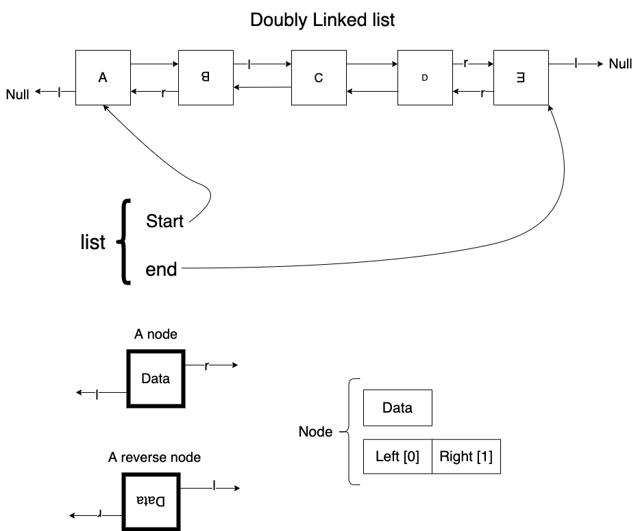

# Double Linked List: List migration

## Requirement

- Time limit: 1s
- Mem Limit: 65536 KB


## Constraint

- n of cargos: max 10e6
- k of lines: 10e3
- l is the index: [0,10e4]

## Printout

- print logs from 0-(k-1) lines
- skip null line

## Plan


- Reader
    - Parse a string
    - Parse an int
    - Parse an int 
    - Terminate for EOF


## Implementation of Double linked list



https://gist.github.com/mycodeschool/7429492

- 遇到 `R`: 
  - 如果 `r` 是 NULL: 結束
  - 從這裡開始用 `l` 讀
- 遇到 `L`
  - 如果 `l` 是 NULL: 結束 
  - 從這裡開始用 `r` 讀

### List

```c
struct list{
    node* start
    node* end
}
```


### node

```c
struct node{
    int data
    node* neighbor[2]
}
```

### Flag Data

- `flag_r`
  - going right `[1]` 
- `flag_l`
  - going left `[0]`
- `buffer`
  - do nothing / ignore
   
```c
update_flag(int* flag, data){
    if (data == flag_r){
        *flag = flag_r
    }
    else if (data == flag_l){
        *flag = flag_l
    }
    else if (data == buffer){
        do nothing
    }
    else {
        do nothing
    }
}
```
- 除了第一次外 (default `flag= flag_r`), 讀到 `flag data` 時要確認
  - 兩邊都不是 `NULL`
    - 用新的 flag 繼續
  - 有一邊是 `NULL`
    - 結束 

- 特性
  - Every list is bounded by node with flag data, and paired with `L` and `R`


## Enter


- New node
  - link `.prev` to `last node`
  - link `.next` to `End`
- End node
  - Link `.prev` to `new node`
- Last node
  - Link `.next` to `new node`


```pseudo
function EnterLine(list*,log)

int flag

ptr_end  = list->end

# check direction

ptr_last = (list->end.prev == NULL) ? list->end.next

end
```


## Migrate


## Reverse a doubly linked list


## Memory

- Node
    - 1 x `int`: 4 byte
    - 2 x `pointer`: 8 bytpe
    - Sum: 20 byte
    - 10e6 nodes: 
        - 20 MB


## References

1. XOR linked list. [[wiki](https://en.wikipedia.org/wiki/XOR_linked_list)]

2. Image (Edite on Diagrams)
   1. [Plan](https://app.diagrams.net/#Hstevengogogo%2FDSA-WastonAbili%2Fmain%2Fimg%2FPlan.png)
   2. [Enter](https://app.diagrams.net/#Hstevengogogo%2FDSA-WastonAbili%2Fmain%2Fimg%2FEnter.png)
   3. [Migrate](https://app.diagrams.net/#Hstevengogogo%2FDSA-WastonAbili%2Fmain%2Fimg%2FMigrate.png)
   4. [Leave](https://app.diagrams.net/#Hstevengogogo%2FDSA-WastonAbili%2Fmain%2Fimg%2FLeave.png)